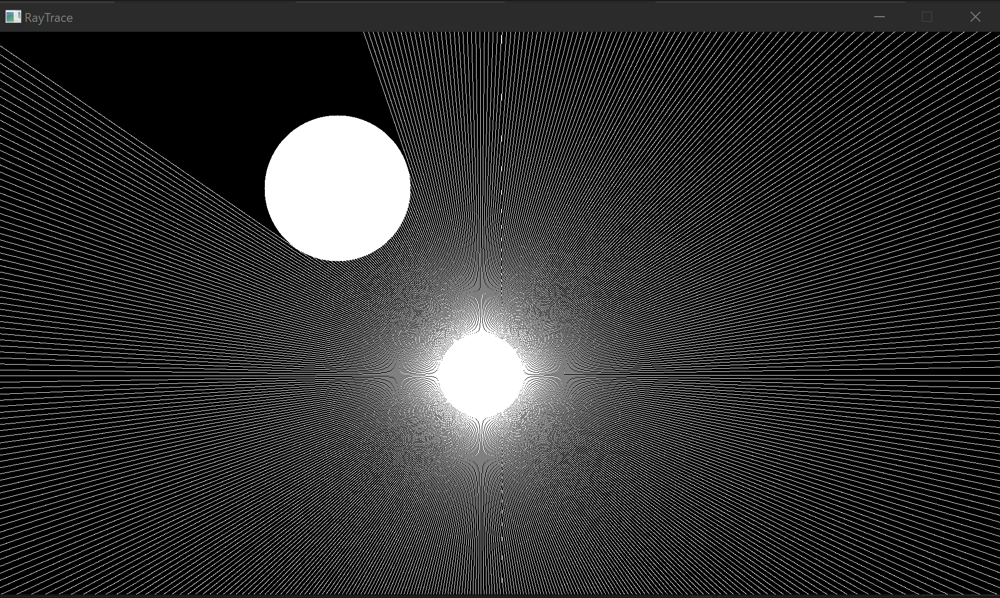

# Ray-Tracing-Using-SDL3-in-C
This is an attempt to develop a simple ray tracing algorithm that demonstrates it's functionalities. 

Ray tracing is a computer graphics technique that simulates how light behaves in the real world. It's used to create realistic images and graphics for games, movies, and more. 

#### Source By Nikolaus Leopold (Mangostaniko) - Own work, CC0, https://commons.wikimedia.org/w/index.php?curid=58447039
This attempt is not an efficient one, this approach is a starting point which is to be improved further using better mathematical formulas. 

This is the result from the program, it is very basic and simple but it works.

